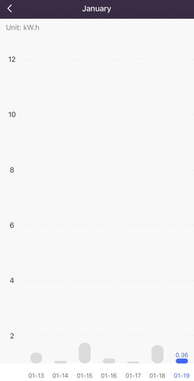
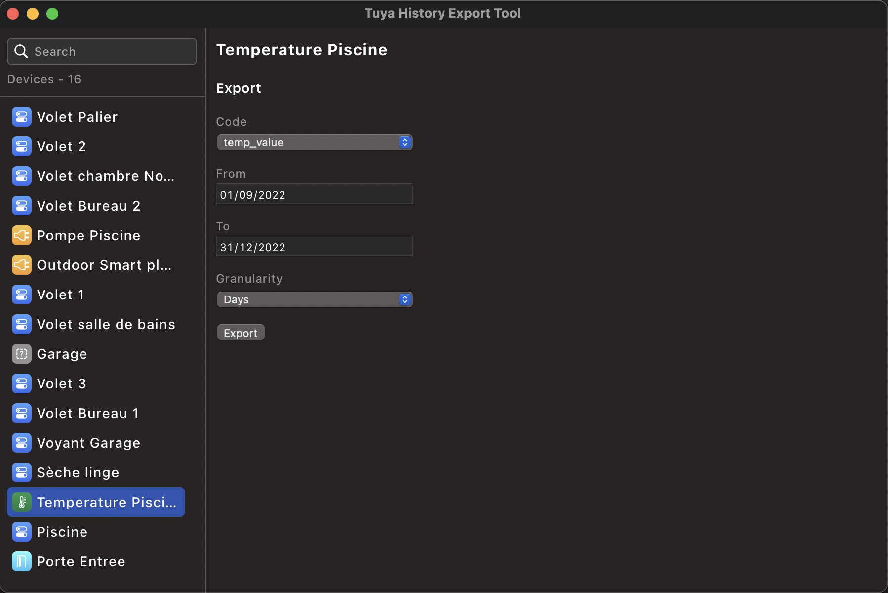

# Tuya data export tool

### Description

Use this tool to export data from iot devices supporting statistics and connected to Tuya. Theses datas are viewable from the Smart Home android/ios app, but is often poorly displayed and not exportable.



This project run via Tauri with a combinaison of vue 3 and rust. The rust layer is needed to have a single page app altough the presence of strict CORS policies on the tuya api

### How to use

As Tuya does not provide a way to authentify via an oauth workflow, thus limiting the distribution of an app / tool on a large scale, we need to create a tuya cloud project on their developer platform, add devices to interact with, and then build a version of the app with a client id and a private key provided by the tuya cloud project.

To get theses credentials:

1. Create an account on https://developer.tuya.com
2. Go to "Iot platform", then create a cloud project "Cloud" -> "Development" -> "Create a cloud project"
3. Click on the new project, in the overview tab, you can retrive the "client id" and the "client secret"
4. Go to the Device tab, go to "Link Tuya App Account" and click on "Add App Account" and follow instructions. This will import all devices that are linked in your Smart life app. You can only give a "Read" access to the project as we don't need more permissions to get data, and it will limit damages if theses credentials get lost
5. Retrieve the "UID" of the previously linked app

With theses infos, you can create a .env file at the root of the project with the format

```TOML
VITE_ACCESSKEY= # Your client id
VITE_SECRETKEY= # Your client secret
VITE_TUYABASEURL=https://openapi.tuyaeu.com # The domain depend of your region, ex: .tuyacn.com for china
VITE_TUYAUSERID= # The UID of the linked map
```

At this point, you have almost finished, with npm version 18, just `npm i` and then `npm run tauri dev` to check everything is working, then you can build you app with `npm run tauri build` (you may need to install rust / webview for tauri to work https://tauri.app/v1/guides/getting-started/prerequisites/)



Tested on Macos, Windows, should work on linux too.

### Notes

- Windows does not have SF font / icons, you may see empty white square instead of desired icons.
- Export in month granularity does not seem to work if the start and end month are not in the same year (tuya related)
- Created files are not unique, you may overwrite a previously exported file when you export data.
- Exported files are created in download folder, no message is displayed when export is finished (need improvements), check your files before clicking a thousand time on the "export" button

### Todo

- [ ] Improve UX/UI on device info compnent (right pane)
- [ ] Fix spaghetti code in component
- [ ] Add notification when an export is done
- [ ] Create a unique file by export
- [ ] Add descriptions for export form fields
- [ ] Add an icon for the app

Feel free to open any review for code fix or additions of features
